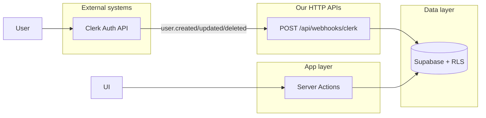

# API documentation

Reference for HTTP Route Handlers, internal Server Actions, and multi-tenancy in the gym platform.

| Document                                      | Description                                          |
| --------------------------------------------- | ---------------------------------------------------- |
| [Multi-tenancy](./multi-tenancy.md)           | How `gym_id` is resolved and scoped per deployment   |
| [Server Actions catalog](./server-actions.md) | Internal app mutations (~28 actions) — not HTTP      |
| [Clerk webhook](./http/clerk-webhook.md)      | `POST /api/webhooks/clerk` — profile sync from Clerk |

**Machine-readable HTTP spec:** [`openapi/openapi.yaml`](../../openapi/openapi.yaml)

**Postman collection:** [`postman/`](../../postman/)

Agent enforcement for new HTTP routes: `.cursor/rules/api-routes.mdc`.

---

## Architecture

The platform uses three mutation surfaces. Only **HTTP Route Handlers** are suitable for external
callers and Postman.

```text
External (Clerk)          App UI (members/staff)         Data layer
       │                           │                          │
       ▼                           ▼                          ▼
POST /api/webhooks/clerk    Server Actions              Supabase + RLS
(inbound webhook)           (src/app/actions/*.ts)        (Postgres)
```



| Surface             | Location               | External use?            | Postman?       |
| ------------------- | ---------------------- | ------------------------ | -------------- |
| HTTP Route Handlers | `src/app/api/**`       | Yes                      | Yes            |
| Server Actions      | `src/app/actions/*.ts` | No — Next.js UI protocol | Document only  |
| Clerk Auth          | Hosted sign-in/up      | Clerk's API, not ours    | Out of scope   |
| Supabase Data API   | Auto-generated REST    | RLS + Clerk JWT          | Reference only |

---

## User lifecycle (today)

1. **Sign-up / sign-in** — Clerk hosted UI (`/sign-up`, `/sign-in`). Not a gym platform REST API.
2. **Profile sync** — Clerk POSTs to [`POST /api/webhooks/clerk`](./http/clerk-webhook.md) on
   `user.created`, `user.updated`, `user.deleted`. Handler upserts `profiles` and creates
   `gym_memberships` for the gym resolved from `NEXT_PUBLIC_GYM_SLUG`.
3. **Member profile edits** — Server Actions (fitness, goals, privacy) invoked from the UI.
4. **Owner CMS / staff ops** — Server Actions with `requireOwner` / `requireStaff`.

Future external REST APIs should be added as Route Handlers under `/api/v1/...`, not by exposing
Server Actions.

---

## Auth models

| Model                   | Used by                | Notes                                 |
| ----------------------- | ---------------------- | ------------------------------------- |
| Clerk webhook signature | `/api/webhooks/clerk`  | `verifyWebhook(req)` + signing secret |
| Clerk session           | Server Actions         | `requireMember`, `requireOwner`, etc. |
| Supabase RLS            | Data reads/writes      | Clerk JWT passed to Supabase          |
| Service role            | Webhooks, audit writes | Server-only; never `NEXT_PUBLIC_*`    |

---

## When to add a Route Handler vs Server Action

| Use Route Handler (`src/app/api/**`) | Use Server Action (`src/app/actions/**`) |
| ------------------------------------ | ---------------------------------------- |
| Webhooks from third parties          | Owner/member UI form saves               |
| Mobile or partner REST integrations  | CMS settings with live preview           |
| Public or API-key authenticated HTTP | Flows tied to React Server Components    |

See `.cursor/rules/api-routes.mdc` for the full checklist when adding HTTP routes.

---

## Response conventions

**HTTP routes** today return simple JSON:

```json
{ "ok": true }
{ "error": "Verification failed" }
```

**Server Actions** use structured results from `src/lib/errors/action-result.ts`:

```typescript
// ActionResult
{ ok: true, data?: T } | { ok: false, error: AppErrorPayload }

// SaveActionResult (CMS forms)
{ ok: true } | { ok: false, message, fieldErrors?, error? }
```

Future `/api/v1/*` routes should align error shapes with `AppErrorPayload` where applicable.
